# AiFaceGaitDoorAccess
利用Python和开源计算机视觉库实现了基于人脸识别和步态识别的智能门禁系统,可以进行双重生物特征认证。

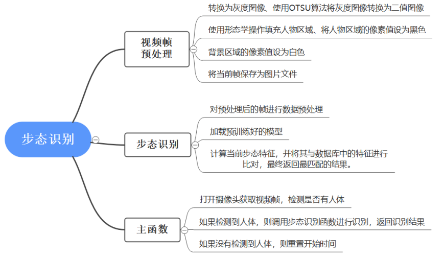

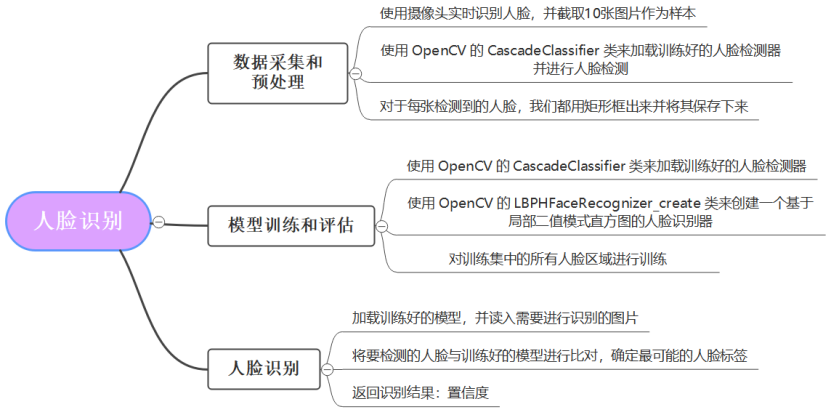

### **6.1.4 **树莓派嵌入

一．系统及环境安装

树莓派系统选择Raspberry Pi OS with desktop 64-bit。

关于Python虚拟环境和包管理选择Python自带的venv包和pip。不选择miniconda3是因为miniconda3支持arm64最高版本为4.9.0。高版本安装会出现Illegal Instruction，低版本安装成功后，使用conda创建虚拟环境再使用匹配同样也会出现Illegal Instruction，因我们只需要在树莓派上运行一个应用，便考虑使用系统Python及venv虚拟环境。

二．程序迁移

首先使用ssh连接树莓派，更新系统环境，创建虚拟环境，pip安装PyTorch和OpenCV等一系列使用到的包。再使用PyCharm远程连接，修改程序中相关路径代码，使用树莓派中的绝对路径。安装数据库，导入相关数据，便可以分别测试步态识别程序和人脸识别程序是否能成功实现，再进行集成测试，在树莓派中连接两个USB摄像头，分别用于捕获人脸数据和步态数据，如图6.4所示。

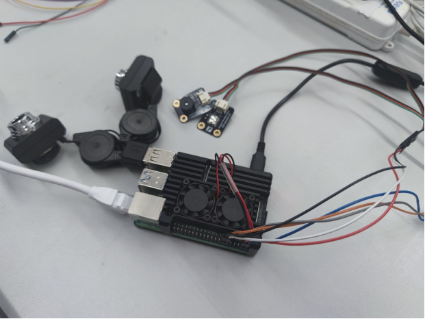 

图6.4 树莓派及扩展

三．系统指示灯连接

树莓派没有使用显示屏，需要使用指示器对系统的识别进度和识别结果进行表示。在本系统中，考虑使用两个指示器进行标识，分别为红色LED灯和蜂鸣器，LED灯闪烁代表系统正在等待识别中，需要先有人进入系统识别区域，录入步态信息。步态信息录入后则LED灯会常亮，代表等待人脸录入，人脸若未成功录入则蜂鸣器连续发出滴滴声，等待几秒后再次进行人脸录入，直到成功。至此，步态和人脸都已录入系统，再系统综合判断之后，返回识别结果。若识别成功，蜂鸣器发出欢快的音乐，门禁打开；若识别失败，蜂鸣器则长鸣发出警报声，告知有非法人员闯入。

树莓派共有40个管脚，可通过gpio readall命令查看所有管脚信息，如图6.5所示。

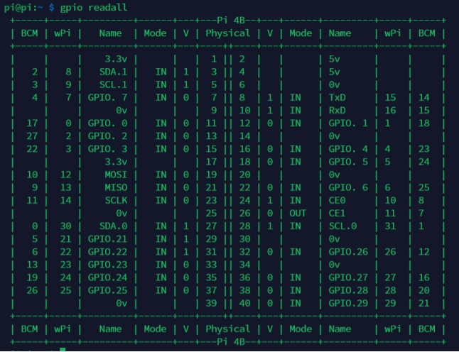 

图6.5 树莓派管脚信息

我们考虑使用Python来控制LED灯和蜂鸣器，相对的使用BCM编码。例如，我们将LED的信号线、电源线和底线分别接到7、4和6号管脚上。然后使用Python中的RPi.GPIO库将GPIO引脚编号模式设置为BCM编号模式，再将4号引脚设置为输出模式，给4号引脚一个高电平，LED灯就会亮起来，在一定的时延之后则在给一个低电平，则LED灯就会熄灭。可以用循环控制LED灯的闪烁，蜂鸣器同理。

## **6.2 测试方案及结果分析**

### **6.2.1** **运行测试**

前端运行成功，如图6.6所示：

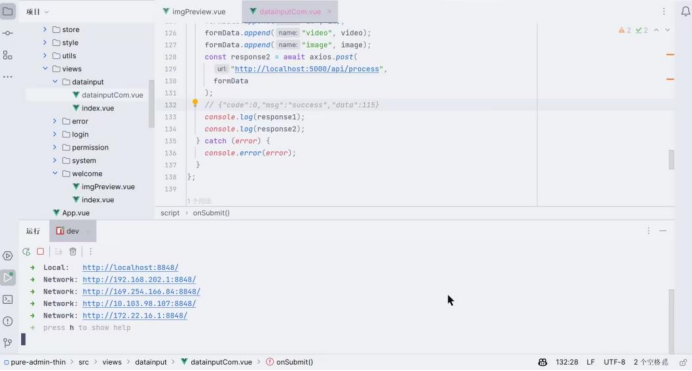 

图6.6 前端运行

后端运行成功，如图6.7所示：

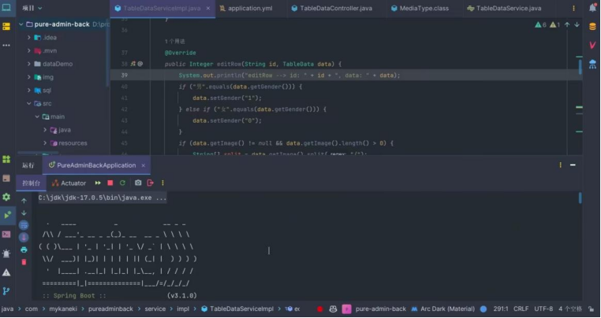 

图6.7 后端运行

一．登录门禁管理系统页面

登录门禁管理系统页面，如图6.8所示。

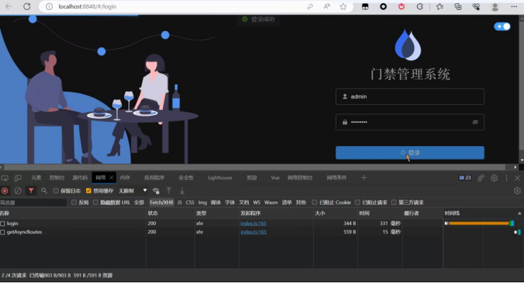 

图6.8 登录页面

可以修改系统页面的主题、导航栏模式等等，如图6.9所示。

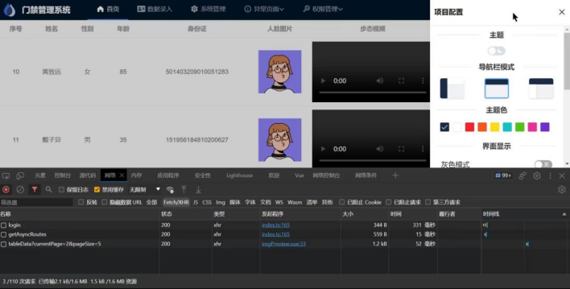 

图6.9 修改页面主题

 

二．数据录入

1.进入数据录入界面，输入用户的姓名、年龄、性别和身份证的信息，如图6.10所示。

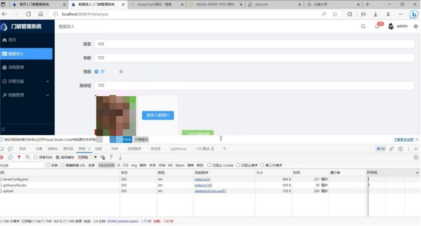 

图6.10 数据录入

2.上传用户的人脸照片以及步态视频到服务器，可查看“upload”接口，提示“sucess”，如图6.11所示。

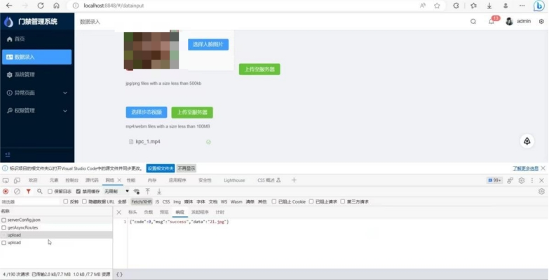 

图6.11 上传数据到服务器

 

3.可查看到用户信息插入成功的提示：“Feature data inserted successfully”，见图6.12。

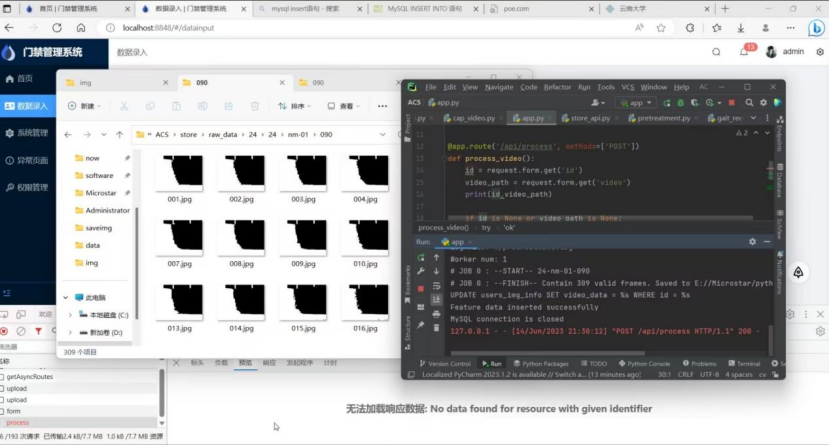 

图6.12 用户信息插入成功

4.查看对应的表，数据已成功添加

（1）users_img_info（人脸数据和步态数据），见图6.13。

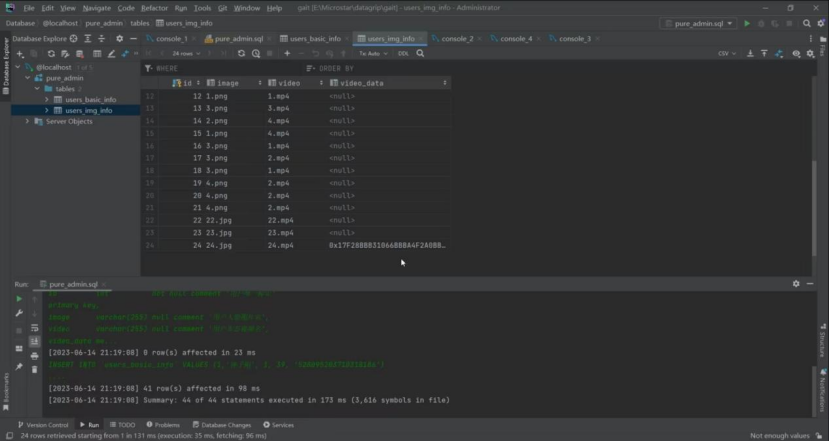 

图6.13 数据成功添加：users_img_info表

（2）users_basic_info（用户姓名等信息），见图6.14。

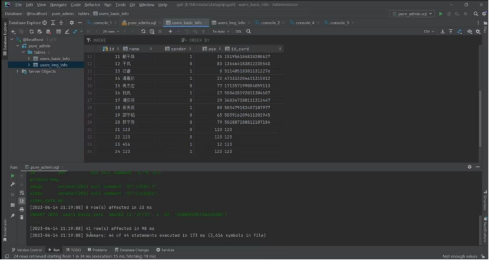 

图6.14 数据成功添加：users_basic_info表

5.重新查看首页，新的用户已成功添加

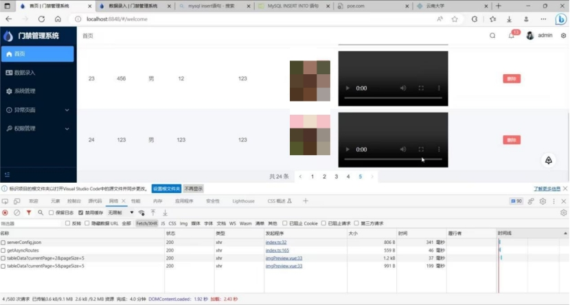 

图6.15 首页成功添加新用户

三．删除用户

1.删除用户信息，提示删除成功，见图6.16。

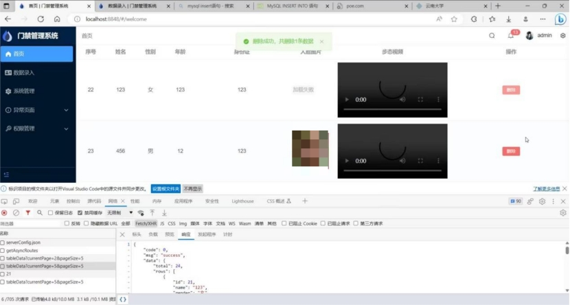 

图6.16 删除成功

2.查看两个表发现第21条用户信息已被删除

（1）users_basic_info（用户姓名等信息），见图6.17。

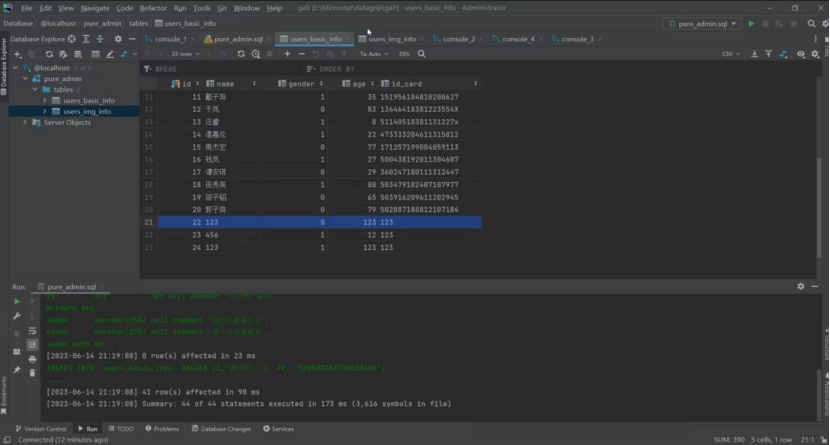 

图6.17 删除成功：users_basic_info表

（2）users_img_info（人脸数据和步态数据）见图6.18。

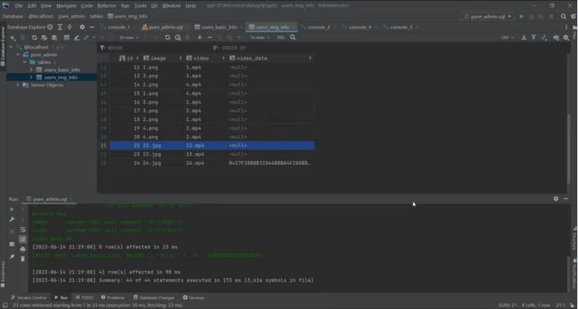 

图6.18 删除成功：users_img_info表

### **6.2.2** **API接口测试**

测试了五组API，见图6.19。

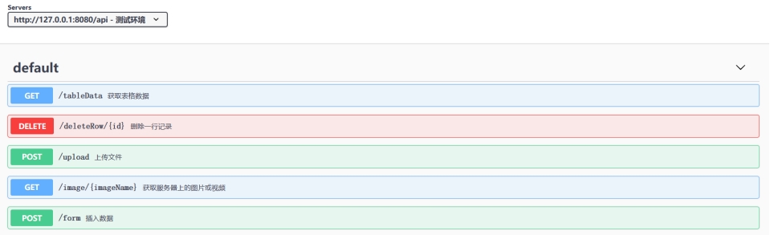 

图6.19 测试API

一．GET /tableData"

是一个 GET 请求类型的接口，用于获取表格数据。

"currentPage" 和 "pageSize" 是该接口的查询参数。

接口返回的响应状态码为 200，表示成功。

响应内容是一个 JSON 数据，包含了请求的表格数据和元信息，如图6.20所示。

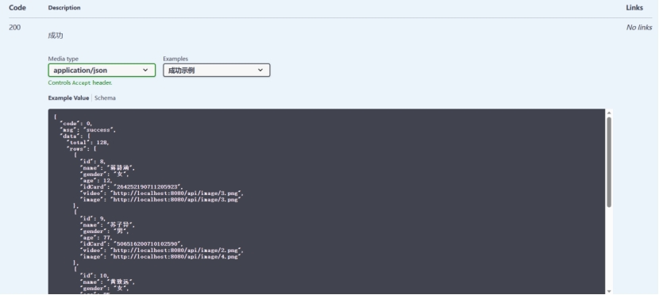 

图6.20 获取表格数据

二．"DELETE /deleteRow/{id}" 

是一个 DELETE 请求类型的接口，用于删除一行记录。

"id" 是必须填写的路径参数。

接口返回的响应状态码为 200，表示成功。

响应内容是一个 JSON 数据，包含了被删除的记录数目，如图6.21所示。

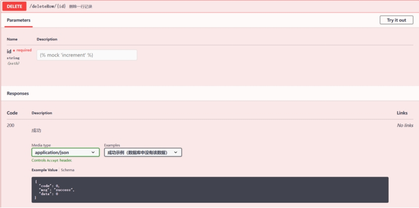 

图6.21 删除一行记录

三．"POST /upload" 

是一个 POST 请求类型的接口，用于上传文件。

请求体需要采用 multipart/form-data 格式，并包含名为 "file" 的二进制文件数据。

接口返回的响应状态码为 200，表示成功。

响应内容是一个空的 JSON 数据，如图6.22所示。

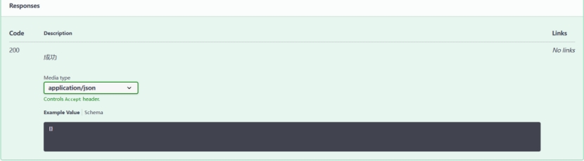 

图6.22 上传文件

四．"GET /image/{imageName}" 

是一个 GET 请求类型的接口，用于获取服务器上的图片或视频。

"imageName" 是必须填写的路径参数，表示所要获取的文件名。

接口返回的响应状态码为 200，表示成功，如图6.23所示。

响应内容是一个二进制数据流。

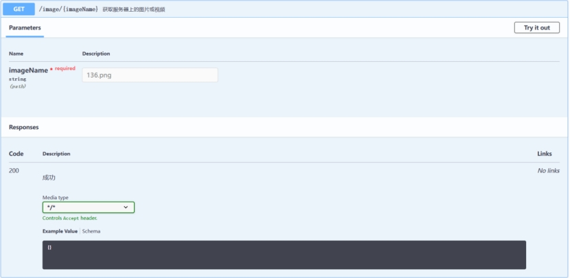 

图6.23 获取服务器上的图片或视频

五．"POST /form" 

是一个 POST 请求类型的接口，用于插入数据。

请求体需要采用 JSON 格式，并包含名为 "name"， "age"， "gender"， "idCard"， "video"， "image" 的字段。

其中 "video" 和 "image" 字段需要填写上传的文件名。

接口返回的响应状态码为 200，表示成功。

响应内容是一个 JSON 数据，包含了插入记录的 ID，如图6.24所示。

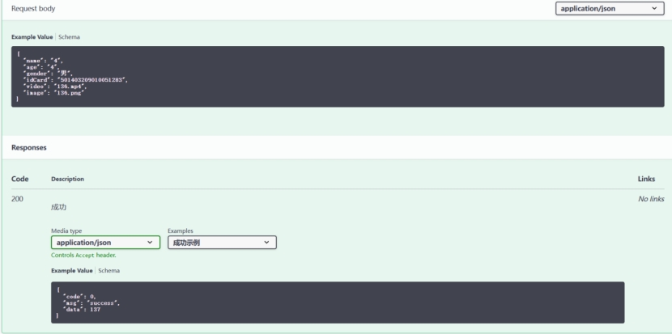 

图6.24 插入数据
